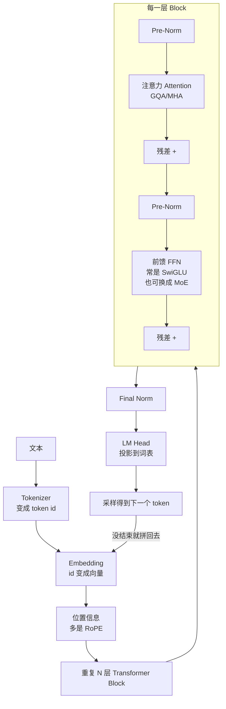
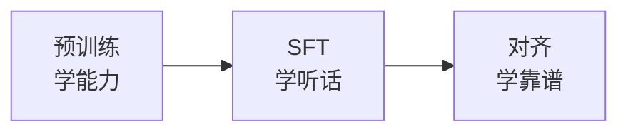
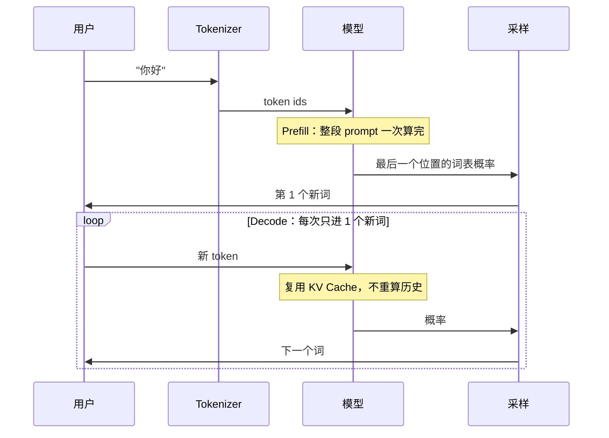
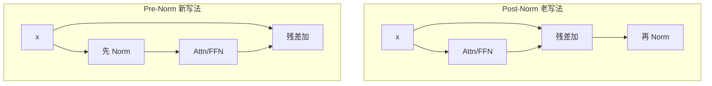
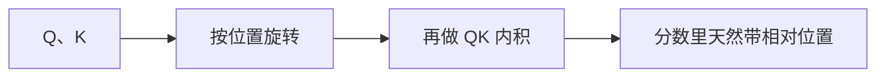
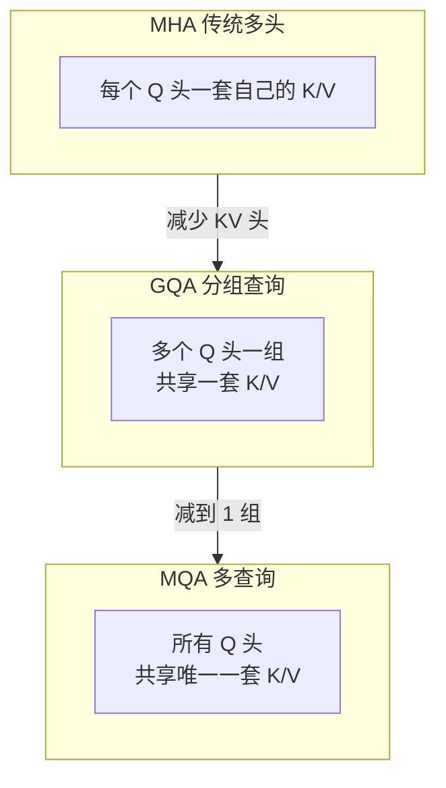
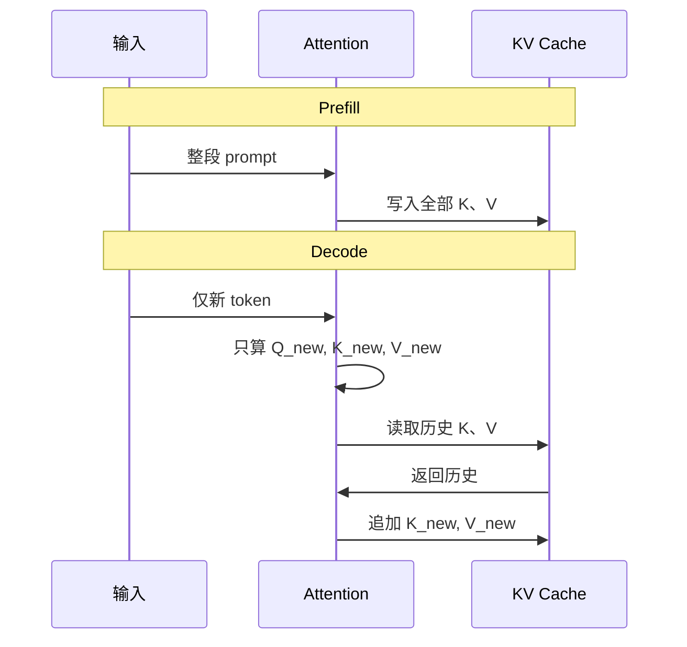
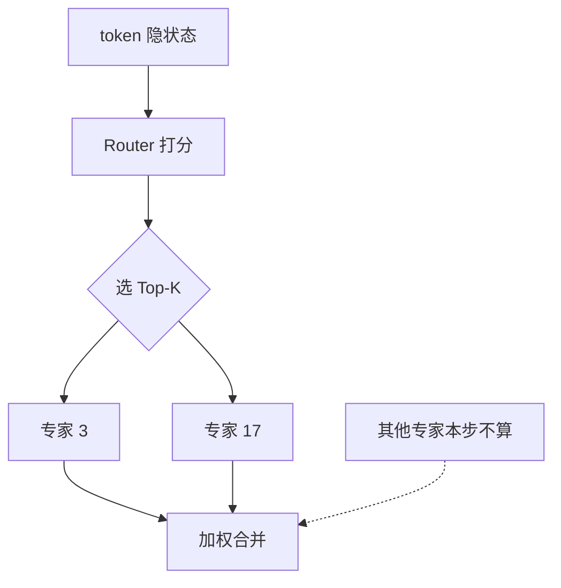

# 大语言模型从零串讲

> 用一条主线把碎片知识串起来：  
> **模型怎么来的 → 里面长什么样 → 每一块为什么这样设计 → 推理时怎么跑得快**  
> 语言尽量直白，公式只保留必要部分。可配合仓库里的 `01_Qwen3.py` 对照阅读。

---

## 0. 先建立一张总地图

你可以把现代 LLM 想成一条流水线：

```text
海量文本
   │
   ▼
① 预训练  ──►  会“续写”的基座模型（Base）
   │
   ▼
② SFT     ──►  会“按指令回答”的对话模型
   │
   ▼
③ 对齐     ──►  更有用、更安全、更听话的最终模型
   │
   ▼
上线推理：用户输入 → Tokenizer → 模型前向 → 采样下一个词 → 循环
```

模型内部（一次前向）长这样：



后面每一节，都是在解释这张图里的某个零件：**它是什么、解决什么问题、和旁边零件怎么配合**。

---

## 1. 模型是怎么“练”出来的：三阶段

GPT 系列把业界路线推成了几乎标准的三步。不必死记名字，要记住**每一步在补什么能力**。

### 1.1 预训练：先学会“说话和常识”

- **数据**：网页、书、代码……海量文本，基本不人工标注  
- **任务**：看上文，猜下一个词（next-token prediction）  
- **得到**：Base 模型——很会续写，但不一定听你的指令  

类比：把孩子扔进图书馆，自己读到能把句子补完。

### 1.2 SFT（有监督微调）：学会“按格式回答”

- **数据**：高质量「用户问题 → 助手回答」  
- **任务**：还是预测下一个词，但分布变成“对话该怎么答”  
- **得到**：会聊天、会遵循指令的模型  

类比：请家教示范标准问答，孩子从“会瞎续写”变成“会答题”。

### 1.3 对齐（RLHF / DPO 等）：学会“答得让人满意”

- **数据**：人类偏好——同样问题，哪个回答更好  
- **任务**：往“更有用、更安全、更少胡编”的方向拧  
- **得到**：更适合上线的 Chat 模型  

类比：作业不只对错，还要文风、态度、价值观过关。



**和本仓库的关系**：  
`01_Qwen3.py` 主要在讲**模型结构 + 推理**；`02_sft_demo.ipynb` 在讲 SFT 时**只对助手回答算 loss**（answer mask）。三阶段里，结构知识贯穿全程，SFT/对齐是训练配方。

---

## 2. 一次完整推理：从一句话到一个词

假设用户说：`你好`

### 2.1 分词（Tokenizer）

模型不看汉字，只看整数 id：

```text
"你好"  →  [108386, ...]
```

词表可以有十几万个 token（Qwen3-0.6B 配置里 `vocab_size=151936`）。

### 2.2 变成向量（Embedding）

每个 id 查一张大表，变成比如 1024 维向量：

```text
[B, T]  →  [B, T, hidden_size]
```

到这里模型还不知道“谁在前谁在后”，所以要位置信息（第 4 节）。

### 2.3 过 N 层 Block

每一层都做两件大事：

| 模块 | 人话 | 作用 |
|------|------|------|
| **Attention** | 每个词去“看”上下文里该看的词 | 信息搬运、建立依赖 |
| **FFN** | 每个词自己在本位置“想一想” | 特征变换、知识加工 |

中间用 **Norm** 稳住数值，用 **残差** 把原信息抄送下去，层数才能堆很深。

### 2.4 输出头 + 采样

最后一层后：

```text
隐状态 → LM Head → 对词表每个词打分(logits) → softmax 成概率 → 选出下一个 token
```

然后把新 token 拼到后面，再跑一轮，直到遇到结束符或达到长度上限。  
这就是**自回归生成**。



---

## 3. 一层 Block 内部：Pre-Norm 骨架

现代 LLM（含本仓库 Qwen3）几乎都是 **Pre-Norm**：

```text
x = x + Attention( Norm(x) )
x = x + FFN( Norm(x) )
```

### 3.1 为什么要 Norm？

深层网络里，数值会越乘越大或越乘越小。  
归一化让每一层输入尺度更稳，训练才训得动。

### 3.2 RMSNorm vs LayerNorm（别被名字吓到）

两者都是“把向量尺度拧正常”，差别只有一句：

| | LayerNorm | RMSNorm（现代主流） |
|--|-----------|---------------------|
| 减均值吗 | 要 | **不要** |
| 怎么缩放 | 除标准差 | 除均方根 RMS |
| 参数 | 常有 γ 和 β | 通常只有 γ |
| 速度 | 稍慢 | 更快一点 |

**人话**：  
LayerNorm = 先把重心扳到 0，再统一长短；  
RMSNorm = 不管重心，只统一长短。  
实践发现 Transformer 里“管尺度”更关键，所以 LLaMA/Qwen 用 RMSNorm。

### 3.3 Pre-Norm vs Post-Norm



- **Post-Norm**：子层算完、残差加上后，再 Norm（原版 Transformer）  
- **Pre-Norm**：先 Norm 再进子层，残差主路更“直通”

**为什么现在几乎全是 Pre-Norm？**  
因为残差希望有一条“原路可以畅通无阻”的高速公路。  
Pre-Norm 里，原始 `x` 可以一层层往下加；Post-Norm 每层都把主路再拧一次，层一深更容易训崩。

Pre-Norm 网络出口通常再加一次 **Final Norm**，再进 LM Head——`01_Qwen3.py` 就是这样。

---

## 4. 位置编码：模型怎么知道顺序

Attention 本身对“交换两个词的位置”不够敏感，必须额外告诉它顺序。

### 4.1 正余弦位置编码（老方法）

给每个绝对位置算一组固定的 sin/cos，**加到 embedding 上**：

```text
词向量 + 位置向量  →  再送进模型
```

低频维度变化慢（粗位置），高频变化快（细位置）。

**缺陷（记住这几条就够）**：

1. **长文本外推差**：训练只到 2k，推理 8k，后面位置模型没见过  
2. **相对距离不直观**：更关心“相距 3”而不是“绝对第 100 和第 103”  
3. **位置和语义糊在一起**：直接加在输入上，层层传下去可能变淡  

### 4.2 RoPE 旋转位置编码（现在主流）

RoPE **不加在 embedding 上**，而是对 Attention 里的 **Q 和 K 做旋转**：

```text
把向量两两一组看成平面上的点
位置越靠后，转过的角度越大
```

妙处在于：位置 m 的 Q 和位置 n 的 K 做内积时，结果自动只跟 **相对距离 m-n** 有关。



**和 sin/cos 对比一句话**：

- sin/cos：把“门牌号”贴在词身上  
- RoPE：让“提问”和“被查的标签”相对转一个角度，距离远近自己体现在匹配分数里  

本仓库 RoPE 细节（对照代码时有用）：

- 不是相邻维 `(0,1)(2,3)` 配对，而是**前后半段** `(0,d/2), (1,d/2+1), …`  
- decode 时用 `offset=current_pos` 取对应位置的 cos/sin  
- 一般**只转 Q/K，不转 V**

---

## 5. 注意力：谁该看谁

### 5.1 人话版 Attention

对每个位置问三件事：

| 名字 | 角色 | 类比 |
|------|------|------|
| **Q (Query)** | 我是谁，我想找什么 | 你这次带来的问题 |
| **K (Key)** | 我有什么标签 | 书架上的分类标签 |
| **V (Value)** | 我真正装的内容 | 书里的正文 |

流程：

```text
用 Q 去和所有 K 比相似度 → 得到权重
用权重去加权求和所有 V → 得到“看完上下文后的新表示”
```

还要加 **因果掩码（Causal Mask）**：生成第 i 个词时，不能偷看右边还没写出来的词。

### 5.2 多头：多双眼睛看不同关系

一个头可能偏重近邻，一个头偏重指代……  
多头 = 多组 QKV，最后拼起来再投影回去。

### 5.3 MHA → GQA → MQA：为推理省钱



| 方案 | KV 头数量 | 效果 | 推理成本 |
|------|-----------|------|----------|
| MHA | = Q 头 | 最好 | 最贵 |
| **GQA** | Q 头的 1/G | **接近 MHA** | **省很多** |
| MQA | 1 | 可能略掉点 | 最省 |

**为什么现代大模型爱 GQA，不爱纯 MHA？**

因为上线时真正卡脖子的经常是 **KV Cache 显存和内存带宽**，不是多几个矩阵乘法：

```text
Cache 大小 ≈ 层数 × 序列长度 × KV头数 × 头维度
```

长上下文（8k/32k/128k）时，MHA 的 cache 可以比模型权重大得多。  
GQA 把 KV 头砍到几分之一，cache 几乎同比例下降，速度也上来，质量还接近 MHA。

Qwen3-0.6B 配置：

```text
Q 头 = 16，KV 头 = 8  →  每 2 个 Q 共享 1 组 K/V
```

代码里会对 K/V 做 `repeat_interleave`，对齐到 Q 的头数再算注意力。

---

## 6. KV Cache：推理加速的关键 equip

### 6.1 问题在哪

自回归生成：每次只多 1 个词，但注意力要看**前面所有词**。

如果每次都把整段话重跑：

```text
第 1 步算 A
第 2 步重算 A,B
第 3 步重算 A,B,C
…
```

历史算力全浪费了。

### 6.2 做法

- **Prefill**：prompt 整段进模型，把每层的 K、V 存进字典  
- **Decode**：只输入新 token（形状经常是 `[B, 1]`），只算它的 K/V，拼到 cache 后面  



### 6.3 训练还是推理？

- **主要用在推理**  
- 训练通常整段并行，不需要一步步 cache  
- 目的：**每个 token 的 K/V 只算一次**，降延迟、提吞吐  

### 6.4 为什么只缓存 K、V，不缓存 Q？

因为下一步计算只需要：

```text
当前新 token 的 Q  ×  全部历史（含自己）的 K、V
```

- 历史 **K/V**：后面每一轮还要被新 Q 来查 → 必须留着  
- 历史 **Q**：只在“当时那一步”用来生成当时的输出 → 用完即弃  

再存一份 Q 又占显存，没有计算收益。

**和 GQA 的合奏**：  
GQA 减少的是“每层要存多少组 K/V”；  
KV Cache 减少的是“历史要不要重算”。  
两者叠加，长文本对话才能跑得动。

---

## 7. FFN：词在本位置“思考”

Attention 负责把别人的信息搬过来；  
**FFN 负责在每个位置上做非线性加工**——很多人把它看成“知识与特征变换”的主要场所之一。

### 7.1 普通 FFN

```text
x → 升维线性层 → 激活(ReLU/GELU) → 降维线性层
```

两个矩阵，结构简单。

### 7.2 GLU / SwiGLU：加一道“门”

GLU = Gated Linear Unit（门控线性单元）。

```text
        ┌─ gate 分支 → 激活 ─┐
x ──────┤                    ├─ 逐元素相乘 ─→ 降维
        └─ up 分支 ──────────┘
```

现代常用 **SwiGLU**（门控激活用 SiLU/Swish）：

```text
h = SiLU(gate_proj(x)) ⊙ up_proj(x)
y = down_proj(h)
```

**多了什么？**

1. 第二条上行分支（gate）  
2. 门控相乘：某些通道可以按输入被关掉或打开  
3. 投影从大约 2 个矩阵变成 3 个（gate / up / down）  

**作用**：不是一刀切变换，而是**有选择地放行特征**，表达力更强；大模型实验里普遍比普通 FFN 好，所以 LLaMA/Qwen 标配 SwiGLU。

本仓库 `FeedForward` 就是这个结构；`intermediate_size=3072`（hidden=1024 时不是简单 4 倍，常为了总参数和 3 矩阵方案对齐而略调）。

---

## 8. MoE：不止一个 FFN，而是一群专家

前面默认：每层只有 **一个** FFN，所有 token 都走它。  
**MoE（Mixture of Experts）** 把它换成：

```text
很多个专家 FFN + 一个小路由器 Router
每个 token 只激活其中 Top-K 个专家
```



### 优势（为什么工业界爱用）

1. **总参数可以很大，单次计算量却不大**（稀疏激活）  
2. 同样算力预算下，模型容量上限更高  
3. 专家可能逐渐分工（代码/数学/多语言等）  
4. 扩展方式直观：多加专家 ≈ 多加容量  

### 代价（别只听优势）

- 总参数仍常驻显存时，**显存不一定省**  
- 路由要防“所有人挤同一个专家”（负载均衡）  
- 工程、分布式、训练稳定性更复杂  

**定位**：MoE 解决的是“FFN 容量 vs 算力”；  
GQA 解决的是“注意力 KV 的推理成本”；  
GLU 解决的是“单个 FFN 内部怎么算更强”。三者可叠加。

---

## 9. 输出端：从隐状态到文字

1. **Final RMSNorm**  
2. **LM Head**：`hidden_size → vocab_size` 线性层  
3. 得到 logits，再 softmax  
4. 采样策略：  
   - greedy：永远选最大（稳但呆）  
   - temperature / top-k / top-p：控制多样性和胡言程度  

很多模型 **共享** Embedding 与 LM Head 权重（`tie_word_embeddings=True`）：  
“词变成向量”和“向量变回词”用同一张表，省参数，也常更稳。

---

## 10. 用 Qwen3-0.6B 把数字钉死（对照本仓库）

配置（`QWEN_CONFIG_06_B`）可以当成一张“身份证”：

| 配置项 | 值 | 含义 |
|--------|-----|------|
| vocab_size | 151936 | 词表多大 |
| hidden_size | 1024 | 主通道宽度 |
| intermediate_size | 3072 | FFN 中间宽 |
| num_hidden_layers | 28 | Block 层数 |
| num_attention_heads | 16 | Q 头数 |
| num_key_value_heads | 8 | KV 头数（GQA） |
| head_dim | 128 | 每头维度 |
| rope_theta | 1e6 | RoPE 频率底 |
| torch_dtype | bfloat16 | 计算精度 |

一次前向形状直觉（batch=1，prompt 长度 7）：

```text
input_ids     [1, 7]
embedding     [1, 7, 1024]
Q             [1, 16, 7, 128]
K/V           [1,  8, 7, 128]   ← GQA 更少
block 输出    [1, 7, 1024]      ← ×28 层
logits        [1, 7, 151936]
取最后位置    [1, 151936]       → 采样 1 个新 token
```

代码地图：

| 概念 | 代码位置 |
|------|----------|
| 整体模型 | `Qwen3Model` |
| Pre-Norm Block | `TransformerBlock` |
| GQA + KV cache | `GroupedQueryAttention` |
| SwiGLU | `FeedForward` |
| RMSNorm | `RMSNorm` |
| RoPE | `compute_rope_params` / `apply_rope` |
| 生成循环 | `generate_text` |
| 权重映射 | `load_qwen3_safetensors_weights` |
| 设备选择 | `get_device()`：cuda → mps → cpu |

---

## 11. 一张“为什么这样设计”总表

把碎片收成设计动机：

| 技术 | 它在解决什么痛点 | 一句话 |
|------|------------------|--------|
| 预训练 | 从零学语言与知识 | 先变得有料 |
| SFT | 基座不会按指令做事 | 学会答题格式 |
| 对齐 | 会答但仍可能有害/废话 | 往人类偏好拧 |
| Embedding | id 不能直接算 | 离散 → 连续 |
| RoPE | 要顺序、要相对距离、要长文本 | 旋转 Q/K 注入位置 |
| Attention | 要上下文依赖 | 按相关性搬信息 |
| 因果掩码 | 生成时不能偷看未来 | 只看左边 |
| GQA | MHA 的 KV Cache 太贵 | 分组共享 K/V |
| KV Cache | 历史反复重算太慢 | 推理只算新 token 的 K/V |
| SwiGLU | 普通 FFN 不够强 | 门控选择特征 |
| MoE | 还想更大容量但不想算力爆炸 | 稀疏激活多专家 |
| RMSNorm | 深层数值不稳 | 轻量归一化 |
| Pre-Norm | 深层难训练 | 残差通路更直 |
| LM Head | 向量要变回词 | 打到词表上采样 |

---

## 12. 推荐阅读顺序（复习用）

如果你只有 30 分钟，按这个顺序过一遍：

1. **第 0–2 节**：总地图 + 一次推理  
2. **第 3 节**：Pre-Norm + RMSNorm（骨架）  
3. **第 5–6 节**：Attention + GQA + KV Cache（推理主战场）  
4. **第 4 节**：RoPE（位置）  
5. **第 7–8 节**：SwiGLU 与 MoE（FFN 侧）  
6. **第 1 节**：训练三阶段（回到“模型从哪来”）  
7. **第 10 节**：对着 `01_Qwen3.py` 把名字对上代码  

更细的填空式答案见同目录：`day02晨测.md`。

---

## 13. 收束：用一段话讲完 LLM

> 我们用海量文本预训练，让模型学会续写；再用指令数据 SFT，让它学会回答；再通过对齐让它更符合人类偏好。  
> 模型本体是一叠 Decoder Block：每层先归一化，再让词通过注意力从上下文取信息（现代多用 GQA 省 KV），加上 RoPE 知道相对位置；然后用带门控的 FFN（SwiGLU，或更大时用 MoE 专家）在本位置思考；残差保证深层可训练。  
> 推理时先 prefill 整段提示并缓存 K/V，再逐步 decode，每次只算新词，采样出下一个 token，循环成完整回答。

---

*文档对应课程仓库知识点整理，可与 `01_Qwen3.py`、`02_sft_demo.ipynb`、`晨测/day02晨测.md` 对照使用。*
